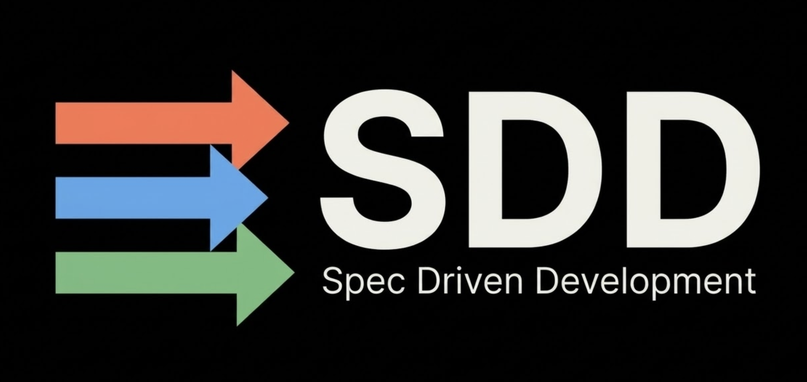

<p align="center">
  
</p>

# `sddw`

[](https://x.com/SDDWorkflows)

Spec-Driven Development Workflow for [Claude Code](https://docs.anthropic.com/en/docs/claude-code).

- Write **requirements**, optionally **analyse the codebase**, then **design** (as self-contained task files), then **implement** each task separately, then **verify** the result
- The agent guides you through every step — researches, proposes options, confirms your decisions
- Every step produces exactly one spec type. Every step reads specs from previous steps.
- `/clear` context between steps — each step works within a focused context window
- Three interaction modes: guided dialog (default), `--critical-only`, or fully `--auto`
- Lightweight and easily customizable — just markdown files, no runtime dependencies

## Why

The standard way to use AI coding agents is short, interactive prompts: describe what you want, get code, fix it, repeat. This works for small tasks but breaks down for anything non-trivial — context gets lost between sessions, architectural decisions live only in chat history, and there's no artifact a teammate can review before code is written.

`sddw` inverts this. Instead of prompting for code, you collaborate with the agent to write **specifications** — requirements, architecture, interface contracts, task breakdowns. The specs become the primary artifact: reviewable by peers, version-controlled, persistent across sessions. Code generation is then a mechanical step guided by approved specs, not a creative leap from a vague prompt.

Detailed specifications reduce AI code errors by up to 50% (Piskala, 2026), security defects by 73% (Marri, 2026), and architecture-misaligned PRs by 60% (GitHub Spec Kit). `sddw` is designed for medium to large projects that don't fit into a single context window. By splitting work into discrete steps — requirements, codebase analysis, design, per-task implementation — each step operates within a focused context where models are more accurate, rather than a sprawling conversation where critical details get lost.

## Install

```bash
git clone https://github.com/sermakarevich/sddw.git ~/.claude/sddw
cd ~/.claude/sddw && bash bin/install.sh
```

For development (symlink from local repo):

```bash
git clone https://github.com/sermakarevich/sddw.git
cd sddw && bash bin/install.sh --local
```

## Interaction Modes

Every step supports three interaction modes:

| Mode | Flag | Behavior |
|------|------|----------|
| **Interactive** | *(default)* | Full guided dialog — one question at a time, every section confirmed |
| **Critical-only** | `--critical-only` | Autonomous research and proposals, pauses only for critical decisions |
| **Auto** | `--auto` | Fully autonomous — no questions, best-judgment decisions |

Example: `/sddw:design my-feature --critical-only`

## Steps

### 1. Requirements

```
/sddw:requirements <feature-name> [--auto | --critical-only]
```

Collaboratively produce a requirements spec through guided dialog:

- **Discover** — understand the feature through one-at-a-time questions
- **Research & Propose** — research SOTA, codebase, domain; propose each section with ranked options
- **Confirm & Generate** — user approves each block, spec is written

Output: `.sddw/<feature-name>/requirements.md`
Sections: Purpose, User Stories, Functional Requirements, Acceptance Criteria, Constraints

### 2. Code Analysis (optional)

```
/sddw:code-analysis <feature-name> [--auto | --critical-only]
```

Analyse the existing codebase to ground design decisions in reality:

- **Discover** — understand which areas of the codebase matter most
- **Research & Propose** — scan for patterns, interfaces, flows, conventions
- **Confirm & Generate** — user approves each section, analysis is written

Output: `.sddw/code-analysis.md` (shared across features)
Sections: Relevant Patterns, Key Interfaces, Existing Flows, Conventions

Skip this step for greenfield projects with no existing codebase.

### 3. Design

```
/sddw:design <feature-name> [--auto | --critical-only]
```

Produce self-contained task files through guided dialog:

- **Discover** — understand architectural preferences and constraints
- **Research & Propose** — propose architecture, data models, contracts, decisions, and task breakdown
- **Confirm & Generate** — user approves each block, task files are written

Output:

```
.sddw/<feature-name>/
└── design/
    └── tasks/
        ├── task-1-<slug>.md  # self-contained: architecture, models, contracts, decisions, criteria
        ├── task-2-<slug>.md
        └── ...
```

Each task file includes all relevant design details inline — architecture, data models, interface contracts, design decisions, and acceptance criteria — so the implementation agent needs only that single file.

### 4. Implement

```
/sddw:implement <feature-name> --task <N> [--auto | --critical-only]
```

Execute a single task from the design spec:

- **Discover** — select task, check dependencies, gather context
- **Research & Propose** — scan codebase, propose implementation approach and TDD applicability
- **Execute** — implement following TDD protocol, commit protocol, and deviation handling

Each task file is self-contained — the agent loads it as primary context without needing any other design document.

After each task, a completion report (`task-N-<slug>.done.md`) is written to `implement/tasks/`, documenting what was done, deviations, and difficulties.

### 5. Verify

```
/sddw:verify <feature-name> [--auto | --critical-only]
```

Verify the implementation against requirements after all tasks are complete:

- **Assess** — load artifacts, detect test runner, check task completion status
- **Verify** — run test suite, cross-check each FR's acceptance criteria, review done criteria
- **Report & Remediate** — produce verification report, create remediation tasks if issues found

Output:

```
.sddw/<feature-name>/
└── verify/
    └── report.md    # FR-by-FR pass/fail, test results, deviations, warnings
```

If issues are found, remediation tasks are created as additional task files in `design/tasks/` (continuing the numbering). These can be executed with `/sddw:implement` and then verified again — the loop repeats until all checks pass.

### Chat

```
/sddw:chat <feature-name> [--auto | --critical-only]
```

Fast-track interaction with a feature that already has artifacts. Skips the full questionnaire ceremony — just load context and talk.

- **Questions** — ask anything about the feature; answered from loaded artifacts and codebase
- **Spec updates** — edit requirements, FRs, acceptance criteria, or task files in-place
- **Quick implementation** — small code changes following TDD and commit protocols
- **Status** — check feature progress

Default mode is **critical-only** — chat assumes you know what you want and only pauses for scope-affecting changes or ambiguous requests.

If a request is too large (new task files, new architecture, >3 files), chat redirects you to the full workflow.

### Help

```
/sddw:help [list | status <feature-name>]
```

- `/sddw:help` — workflow overview and available commands
- `/sddw:help list` — list all features with progress indicators
- `/sddw:help status <feature-name>` — detailed feature status: which steps are done, task progress, completion reports

## Anatomy of a Step

Each step is assembled from four modular components:

| Component | Purpose | Folder |
|-----------|---------|--------|
| **Command** | Thin entry point with frontmatter + `@references` | `commands/` |
| **Instructions** | Process rules — what to do, in what order | `instructions/` |
| **Questionnaire** | Dialog guidance — how to interact with the user | `questionnaires/` |
| **Specs** | Output format templates — what to produce | `specs/` |

A command wires these together:

```
┌──────────────────────────────────────────────────────────┐
│ commands/<step>.md                                       │
│                                                          │
│  @instructions/<step>.md        ← process rules          │
│  @questionnaires/<step>.md      ← dialog flow            │
│  @specs/<step>.md               ← output format          │
│                                                          │
│  reads:  .sddw/<feature>/<previous_step>.md  ← input     │
│  writes: .sddw/<feature>/<current_step>.md   ← output    │
└──────────────────────────────────────────────────────────┘
```

Each component lives in its own folder so they can be reused, tested, and evolved independently. The command file itself stays small — just references and glue.

Every step follows a three-phase dialog: **Discover → Research & Propose → Confirm & Generate**. One question at a time, structured options, every spec block confirmed by the user before generation.
